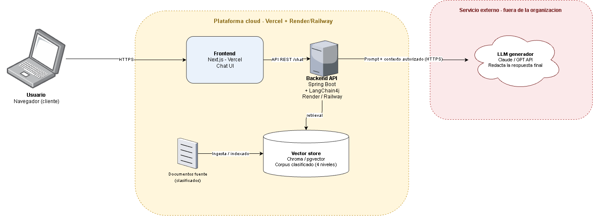
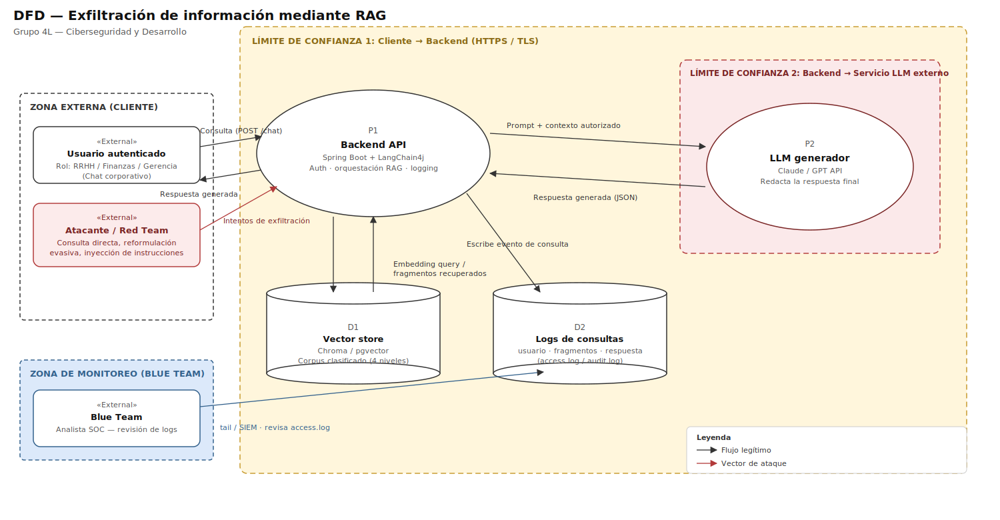

<div align="center">

# 🛡️ Exfiltración de Información mediante RAG. Backend

### API en Java con Spring Boot y LangChain4j. Control de acceso por usuario, rol y clasificación

[]()
[]()
[]()
[](https://github.com/ORG_O_USUARIO/rag-exfiltration-frontend)

*Escuela Colombiana de Ingeniería Julio Garavito*

</div>

---

## 📑 Tabla de contenidos

- [Descripción del proyecto](#-descripción-del-proyecto)
- [Equipo](#-equipo)
- [Objetivos](#-objetivos)
- [Arquitectura](#-arquitectura)
- [Modelo de amenazas DFD](#-modelo-de-amenazas-dfd)
- [Tecnologías](#-tecnologías)
- [Cómo funciona](#-cómo-funciona)
- [Estructura de este repositorio](#-estructura-de-este-repositorio)
- [Metodología y fases del proyecto](#-metodología-y-fases-del-proyecto)
- [Cómo ejecutar el backend](#-cómo-ejecutar-el-backend)
- [Declaración de uso de IA](#-declaración-de-uso-de-ia)
- [Referencias](#-referencias)
- [Conclusiones](#-conclusiones)

---

## 📖 Descripción del proyecto

Los asistentes conversacionales corporativos usan cada vez más RAG, sigla de Retrieval Augmented Generation, para responder preguntas apoyándose en documentos internos, en lugar de depender únicamente del conocimiento aprendido durante el entrenamiento del modelo.

Esta arquitectura resuelve problemas de actualidad y precisión de la información, pero introduce una superficie de ataque nueva. Cuando el motor de recuperación no respeta los permisos que la organización asigna a cada usuario, el asistente puede terminar exponiendo fragmentos de documentos restringidos a personas que jamás deberían haber tenido acceso a ellos. OWASP incluye este riesgo dentro de su listado de riesgos críticos para aplicaciones basadas en LLM, en la categoría de debilidades de vectores e incrustaciones.

Este proyecto construye un asistente RAG básico, diseña ataques de exfiltración controlados contra él, y evalúa mecanismos de control de acceso por usuario, rol y nivel de clasificación que impidan que el asistente revele información confidencial a usuarios no autorizados.

> 📎 El marco teórico completo del proyecto está en [`docs/marco-teorico/`](docs/marco-teorico/).

## 👥 Equipo

**Grupo 4L. Ciberseguridad y Desarrollo**

| Integrante | Rol en el proyecto |
|---|---|
| Juan Pablo Caballero Castellanos | Desarrollo backend y RAG |
| Robinson Steven Nuñez Portela | Arquitectura y seguridad |
| Oscar Andrés Sánchez Porras | Pruebas de exfiltración y documentación |

**Asignatura:** Fundamentos de Seguridad de la Información
**Profesora:** Tatiana Marcela Gómez Sarmiento

## 🎯 Objetivos

**Objetivo general**

Diseñar y evaluar mecanismos de control de acceso para un sistema RAG que impidan la exfiltración de documentos restringidos hacia usuarios sin los permisos correspondientes.

**Objetivos específicos**

- Caracterizar la arquitectura de un sistema RAG y los puntos donde puede producirse una fuga de información.
- Diseñar escenarios de prueba que intenten recuperar documentos restringidos mediante consultas directas e indirectas.
- Proponer y evaluar filtros de acceso aplicados por usuario, por rol y por nivel de clasificación de la información.
- Analizar la efectividad y las limitaciones de dichos filtros frente a técnicas de evasión conocidas.

## 🏗️ Arquitectura



El sistema se organiza en tres zonas con niveles de confianza distintos: el cliente, que es el navegador del usuario o del Red Team, la infraestructura propia del proyecto con el frontend, el backend y el almacén vectorial, y un servicio de terceros que provee el modelo de lenguaje. Esa separación es la que define dónde se puede aplicar un control y dónde ya no, que es justamente lo que el proyecto quiere medir.

### Componentes

| Componente | Tecnología | Repositorio | Despliegue |
|---|---|---|---|
| Frontend del chat | Next.js | `rag-exfiltration-frontend` | Vercel |
| Backend y API | Java 21 con Spring Boot | `rag-exfiltration-backend`, este repo | Render o Railway |
| Orquestación RAG | LangChain4j | este repo | No aplica |
| Vector store | Chroma o pgvector | este repo | Render o Railway |
| Corpus documental | 4 niveles de clasificación | este repo, carpeta `corpus/` | No aplica |
| LLM generador | API de Claude o GPT | No aplica | Servicio de terceros |

### Qué hace cada pieza

**Frontend en Next.js sobre Vercel.** Es únicamente la interfaz de chat. No tiene lógica de autorización ni credenciales del LLM. Su única responsabilidad es autenticar al usuario y enviar la consulta al backend. Cualquier control implementado aquí sería trivial de evadir, porque un atacante puede llamar directamente al endpoint `/chat` sin pasar por la interfaz. Por eso el frontend se trata como código no confiable en el modelo de amenazas.

**Backend y API con Spring Boot y LangChain4j.** Es el punto donde se concentra toda la seguridad del sistema. Recibe la consulta junto con la identidad y el rol del usuario, genera el embedding, consulta el almacén vectorial, arma el prompt y llama al LLM. Es el único componente que conoce simultáneamente la identidad del usuario y el contenido de los fragmentos recuperados, y por eso es el único lugar donde tiene sentido decidir qué puede salir hacia el modelo. Las tres capas de defensa del proyecto se implementan aquí: filtrado en la recuperación, refuerzo del mensaje del sistema y validación de la respuesta.

**Vector store con Chroma o pgvector.** Guarda las incrustaciones de cada fragmento del corpus junto con sus metadatos: nivel de clasificación, roles autorizados y, cuando la restricción es individual, la lista de usuarios permitidos. Esos metadatos son lo que hace posible el filtrado del Avance 2. Sin ellos, la búsqueda sólo puede ordenar por similitud semántica y no tiene forma de saber quién pregunta.

**Corpus documental.** Archivos de prueba etiquetados en cuatro niveles equivalentes a los que sugiere ISO/IEC 27001: público, interno, confidencial y secreto. Cada documento se asocia además a roles como recursos humanos, finanzas o gerencia. Es material sintético creado para el proyecto y no contiene información real de ninguna organización.

**LLM generador expuesto como API externa.** Redacta la respuesta final a partir de los fragmentos que le entrega el backend. Está fuera de la infraestructura propia, lo que implica dos cosas. Todo fragmento que se le envíe sale del perímetro del proyecto, y ningún control aplicado sobre él es verificable por el equipo. De ahí la regla de diseño principal del sistema: un fragmento no autorizado nunca debe llegar al prompt, porque una vez enviado ya no hay control posible sobre él.

### Decisiones de diseño relevantes para la seguridad

- **El filtrado ocurre antes de la generación, no después.** Filtrar la respuesta del modelo sería una defensa tardía, porque el contenido restringido ya habría salido hacia el proveedor externo. La validación de la respuesta del Avance 3 existe como última línea de defensa, no como control principal.
- **Backend y frontend están en repositorios y servicios de despliegue separados.** Esto mantiene las credenciales del LLM y la lógica de autorización fuera de cualquier artefacto que se entregue al navegador, lo que atiende el riesgo R-08 del risk register.
- **La identidad del usuario viaja con cada consulta.** El backend no confía en un rol enviado por el cliente sin verificar. La sesión autenticada es la fuente de verdad del perfil con el que se filtra.
- **Todo el tráfico externo va cifrado con HTTPS y TLS**, tanto del cliente hacia el backend como del backend hacia el LLM.

## 🧩 Modelo de amenazas DFD



El diagrama de flujo de datos descompone el sistema en procesos, almacenes y entidades externas, y traza sobre ellos los límites de confianza, es decir las fronteras que un dato cruza al pasar de un dominio controlado a otro. Los riesgos aparecen precisamente en esos cruces, por lo que el DFD es la base del [`risk-register.md`](risk-register.md).

### Elementos del diagrama

**Entidades externas**

- **Usuario autenticado.** Persona legítima con un rol asignado de RRHH, Finanzas o Gerencia. Representa el flujo normal del sistema y sirve de línea base para medir la métrica de ventaja de acceso.
- **Atacante o Red Team.** El mismo rol de usuario autenticado, pero con intención de acceder a material por encima de su nivel. Es un usuario legítimo del sistema, no un intruso externo. El modelo de amenazas asume que la autenticación ya fue superada y que lo que falla es la autorización.
- **Blue Team.** Analista que revisa los logs para detectar intentos de exfiltración. Aporta la capa de detección del proyecto.

**Procesos**

- **P1, Backend API.** Autentica, orquesta el pipeline RAG y registra la actividad. Concentra los tres puntos de control del sistema.
- **P2, LLM generador.** Redacta la respuesta final. Es un proceso que el equipo no controla ni puede auditar.

**Almacenes de datos**

- **D1, Vector store.** Incrustaciones y metadatos de clasificación del corpus.
- **D2, Logs de consultas.** Registro de usuario, fragmentos recuperados y respuesta entregada. Da trazabilidad a las pruebas, cumpliendo el accounting del modelo AAA, y es a la vez un activo sensible porque puede contener fragmentos del material restringido, lo que corresponde al riesgo R-09.

### Límite de confianza 1: del cliente hacia el backend

Toda petición viaja por HTTPS y TLS, y aquí se ubica el primer punto de control, que es la autenticación y la autorización. Lo que cruza esta frontera es una consulta más una identidad. Nada de lo que llegue del cliente puede considerarse confiable, incluido el rol declarado. Si el backend aceptara el perfil que le envía el navegador, un atacante sólo tendría que modificar la petición para elevarse a Gerencia.

Los tres vectores de ataque del proyecto entran por esta frontera:

| Vector | Qué intenta | Riesgo asociado |
|---|---|---|
| **Consulta directa** | Pedir explícitamente el contenido de un documento restringido | R-01 |
| **Reformulación evasiva** | Pedir un resumen o paráfrasis para evitar filtros por palabra clave | R-02 |
| **Inyección de instrucciones** | Insertar una orden que le pida al modelo ignorar las restricciones | R-03 |

Los dos primeros se neutralizan en la etapa de recuperación durante el Avance 2. Si el fragmento nunca se recupera, da igual cómo se formule la pregunta. El tercero no, porque no ataca al recuperador sino al modelo, y por eso se atiende en el Avance 3 con refuerzo del prompt y validación de la respuesta.

### Límite de confianza 2: del backend hacia el LLM externo

El prompt y el contexto recuperado salen de la infraestructura propia hacia un servicio de terceros. Este cruce es irreversible. Una vez enviado un fragmento, el equipo pierde toda capacidad de control sobre él, y ningún filtro posterior lo recupera. Esto define la regla de diseño ya mencionada, según la cual sólo cruza esta frontera lo que el usuario ya está autorizado a ver, y explica por qué el control principal se aplica en la recuperación y no en la salida.

### Riesgos que no cruzan ninguna frontera

El DFD también deja ver amenazas que actúan directamente sobre los almacenes, sin pasar por la interfaz conversacional:

- **Envenenamiento del vector store, riesgo R-04.** Documentos maliciosos insertados en la ingesta, que luego se recuperan ante consultas específicas.
- **Inversión de incrustaciones, riesgo R-05.** Reconstrucción aproximada del texto original a partir de su representación numérica, por parte de quien tenga acceso al almacén.

Ambos confirman que el filtrado en la recuperación protege la interfaz conversacional, pero no sustituye la protección del almacén vectorial con sus propios controles de acceso y cifrado en reposo.

> 📋 El detalle de probabilidad, impacto, tratamiento y responsable de cada riesgo está en [`risk-register.md`](risk-register.md).

## ⚙️ Tecnologías

- **Lenguaje:** Java 21
- **Framework:** Spring Boot
- **Orquestación RAG:** LangChain4j
- **Vector store:** Chroma o pgvector
- **LLM:** API de Claude o GPT
- **Control de versiones:** Git y GitHub
- **Despliegue:** Render o Railway

## 🔄 Cómo funciona

1. El usuario envía una consulta desde el chat del repo `rag-exfiltration-frontend`.
2. Este backend recibe la consulta junto con el usuario y su rol asignado.
3. Genera el embedding de la consulta y recupera del vector store los fragmentos más similares del corpus.
4. Los fragmentos recuperados se envían junto con la consulta al LLM, que redacta la respuesta.
5. La respuesta se devuelve al frontend y toda la interacción queda registrada en logs con el usuario, los fragmentos recuperados y la respuesta.
6. Sobre este flujo se ejecutan los ataques de prueba definidos en la metodología, para medir cuánta información se filtra según la capa de control de acceso activa en cada avance.

## 📂 Estructura de este repositorio

El proyecto se reparte en dos repositorios. Este, `rag-exfiltration-backend`, contiene la API, el pipeline RAG y toda la documentación de seguridad. El otro, [`rag-exfiltration-frontend`](https://github.com/ORG_O_USUARIO/rag-exfiltration-frontend), contiene el chat en Next.js. La documentación se concentra aquí porque es este repo el que contiene la lógica y las pruebas de seguridad del sistema.

```
.
├── README.md                     # Este archivo
├── risk-register.md              # Registro y matriz de riesgos del proyecto
├── pom.xml                       # Próximo paso: proyecto Maven Spring Boot
├── src/                          # Próximo paso: código fuente del backend
├── corpus/                       # Documentos de prueba clasificados
├── docs/
│   ├── marco-teorico/            # Paper base y referencias del proyecto
│   └── diagrams/
│       ├── da_rag.png            # Diagrama de arquitectura
│       └── dfd_rag.png           # Diagrama de flujo de datos
└── evidencias/
    ├── fase-A/                   # Evidencias del Avance 1
    ├── fase-B/                   # Evidencias del Avance 2
    └── fase-C/                   # Evidencias del Avance 3
```

## 🗺️ Metodología y fases del proyecto

| Fase | Avance | Contenido |
|---|---|---|
| **A** | Avance 1 | Corpus de prueba, pipeline RAG básico **sin filtrado**, demostración de los 3 ataques de exfiltración |
| **B** | Avance 2 | Filtrado en la recuperación por usuario, rol y clasificación, más la métrica de ventaja de acceso |
| **C** | Avance 3 | Refuerzo del prompt del sistema, validación de la respuesta, análisis de riesgo residual |

Cada fase agrega sus capturas, logs y resultados en `evidencias/fase-X/`.

## ▶️ Cómo ejecutar el backend

> 🚧 Sección en construcción. Se completará junto con el `pom.xml` y la implementación del Avance 1, incluyendo build, variables de entorno, ejecución local y despliegue.

## 🤖 Declaración de uso de IA

En cumplimiento del compromiso ético del equipo, se deja constancia de que se usaron herramientas de inteligencia artificial, concretamente Claude de Anthropic, como apoyo para:

- Planeación de arquitectura y estructura de los repositorios.
- Generación de los diagramas base de arquitectura y DFD, y del contenido de este README.
- Redacción y organización de la documentación.

Las evidencias de las pruebas de exfiltración, el código del sistema RAG y los resultados presentados corresponden al trabajo realizado por los integrantes del grupo, desarrollado en entornos controlados y autorizados, tal como se certifica en el marco teórico del proyecto.

## 📚 Referencias

Ver la lista completa de referencias en el documento del marco teórico: [`docs/marco-teorico/Exfiltracion_RAG_Marco_Teorico.pdf`](docs/marco-teorico/Exfiltracion_RAG_Marco_Teorico.pdf).

## ✅ Conclusiones

> 🚧 Sección en construcción. Se irá completando al cierre de cada avance, con los hallazgos acumulados del proyecto.

---

<div align="center">

*Proyecto académico. Fundamentos de Seguridad de la Información. Septiembre 2026*

</div>
